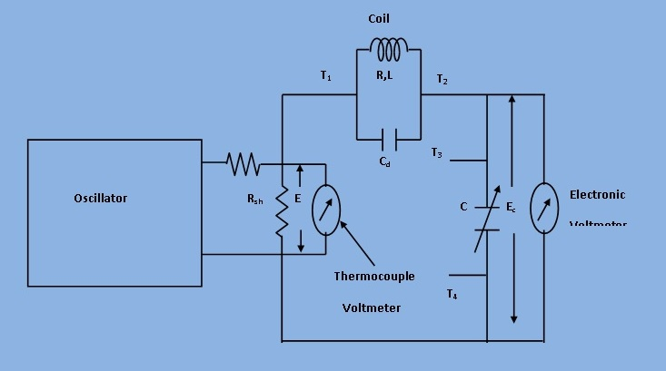

## Introduction

In this bridge, a capacitance is measured with a standard variable capacitance.The connection is shown in the figure. 
This bridge is a modification of De Sauty's bridge.

***Fig 1: The practical circuit of unknown coil***

